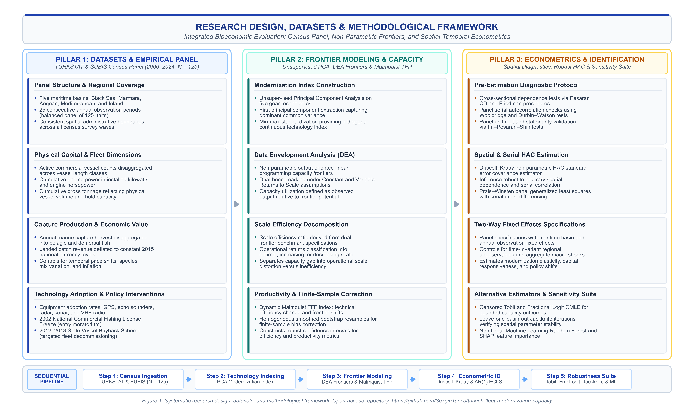
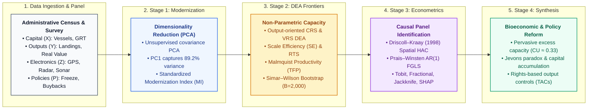

# Technological Modernization Fails to Improve Fleet Capacity Utilization in Turkish Marine Capture Fisheries

[](https://opensource.org/licenses/MIT)
[](https://www.r-project.org/)
[](https://www.python.org/)
[](#reproducibility-guide)

**Author:** Dr. Sezgin Tunca  
**Contact:** `sezgin.tunca@gmail.com`  
**Journal Target:** *ICES Journal of Marine Science* (Oxford University Press)  
**Manuscript ID:** ICESJMS-2026-474  

---

## Overview and Abstract

This repository provides the complete, audited replication data, empirical estimation scripts, and publication-quality figure generation routines for the study:

> **Tunca, S. (2026).** *Technological Modernization Fails to Improve Fleet Capacity Utilization in Turkish Marine Capture Fisheries.* Under review at **ICES Journal of Marine Science**.

### Abstract
To address the persistent challenge of fleet overcapacity in Mediterranean and Black Sea fisheries, this study examines the empirical interplay between technological modernization, capacity utilization, and structural persistence across the commercial fishing fleet of Türkiye spanning the 25-year period 2000–2024. Using official administrative records from the Turkish Statistical Institute (TURKSTAT) and the Fishery Information System (SUBIS), I construct a composite Modernization Index (MI) via Principal Component Analysis and estimate non-parametric Data Envelopment Analysis (DEA) capacity utilization scores across five ecologically heterogeneous maritime basins (Mediterranean, Aegean, Marmara, West Black Sea, and East Black Sea). The analytical framework integrates dual Constant Returns to Scale (CRS) and Variable Returns to Scale (VRS) frontiers, Malmquist Total Factor Productivity (TFP) decomposition, and second-stage macro-panel econometric estimators explicitly robust to serial autocorrelation, heteroskedasticity, and spatial cross-sectional dependence (Driscoll–Kraay spatial HAC and Prais–Winsten AR(1) FGLS).

Empirical findings demonstrate substantial excess capacity across the national fleet, with an aggregate mean Capacity Utilization ($CU$) of only 0.334. Frontier growth has been driven almost exclusively by outward technical progress rather than regional efficiency catch-up. Furthermore, scale efficiency decomposition reveals that over 44% of measured capacity underutilization stems from structural scale mismatch (predominantly Decreasing Returns to Scale in industrial basins and Increasing Returns to Scale in small-scale coastal basins) rather than pure operational inefficiency. Crucially, after correcting for severe temporal persistence ($\text{AR}(1) \approx 0.83$) and shared macroeconomic shocks, the econometric relationship between technological adoption and landed catch value is statistically insignificant. In addition, state-subsidized vessel decommissioning programs (2012–2018), which retired 1,214 vessels at a public expenditure of 158.3 million TRY, were associated with negative shifts in capacity utilization and real catch value due to small-scale size-selection bias and compensatory capital upgrading ("capital accumulation") in the non-decommissioned fleet. These results highlight a classical fisheries adaptation of the "technology treadmill" and Jevons paradox under open-access conditions, demonstrating that technological modernization cannot substitute for rights-based effort rationalization.

---

## Methodological & Research Design Workflow

The analytical architecture and empirical progression of this study are structured across four integrated stages, moving from official administrative data harmonization to non-parametric frontier estimation, spatial-HAC panel econometrics, and bioeconomic policy synthesis.



> **Editable Format:** The research design framework diagram is available in native editable **draw.io format** ([`figures/Fig1_research_design_framework.drawio`](figures/Fig1_research_design_framework.drawio)) for use in [diagrams.net](https://app.diagrams.net) or VS Code, alongside publication-quality vector [PDF (`Fig1_research_design_framework.pdf`)](figures/Fig1_research_design_framework.pdf).



---

## Theoretical & Empirical Insights

### 1. The Technology Treadmill and Jevons Paradox in Fisheries
Standard bioeconomic theory predicts that introducing advanced fish-finding and navigational equipment (satellite GPS, echo sounders, radar, sonar) increases effective fishing power by 2% to 5% annually (Eigaard et al., 2014; Palomares & Pauly, 2019; Rijnsdorp et al., 2006, 2008). In open-access or loosely regulated fisheries, individual vessel owners adopt electronic technology defensively to protect their catch shares against competing operators. However, because aggregate wild fish stocks are biologically constrained, total catch cannot expand proportionally. The consequence is a resource-specific **Jevons paradox**: technological progress lowers the marginal cost of searching for fish, intensifying fleet competition and accelerating stock depletion until resource rents are entirely dissipated.

### 2. Capital Accumulation Under Administrative Licensing Freezes
In 2002, Turkish fisheries authorities imposed an administrative freeze on issuing new commercial fishing licenses under Fisheries Law No. 1380 (*1380 Sayılı Su Ürünleri Kanunu*). While this moratorium capped the nominal number of licensed vessels, statutory loopholes permitted license holders to upgrade hulls, install higher-horsepower engines, and integrate cutting-edge acoustic equipment. Vessel operators systematically substituted unconstrained technological and physical capital for restricted nominal vessel numbers—a classic illustration of **capital accumulation** (Townsend, 1985; Wilen, 1979).

### 3. Asymmetric Vessel Buyback Schemes
Between 2012 and 2018, four successive decommissioning programs retired 1,214 vessels. However, participation was heavily skewed toward small-scale, low-powered coastal craft (88.7% to 98.6% of buyback vessels were under 12 meters in length). The capital-intensive industrial purse-seine and bottom-trawl segments—which account for more than 85% of total marine landings and physical effort—remained largely intact. The capacity retired by small craft was rapidly counterbalanced by electronic upgrades in the remaining commercial fleet, rendering the policy ineffective in reducing aggregate fishing pressure.

---

## Repository Architecture

```
turkish-fleet-modernization-capacity/
├── README.md                           <- [This file] Complete project guide and documentation
├── LICENSE                             <- Open-access MIT License
├── requirements.txt                    <- Python dependencies (pandas, statsmodels, linearmodels, geopandas)
├── install_packages.R                  <- Automated CRAN package installer for R (deaR, dplyr, etc.)
│
├── data/                               <- Audited input datasets and GIS boundaries
│   ├── panel_fisheries_modernization_2000_2024.csv    <- 25-year panel (125 basin-year records)
│   ├── regional_fleet_composition_summary.csv         <- Fleet structure and landings by segment (Table 1)
│   ├── data_coastal_ports_geocoded.csv                <- 386 coastal fishing facilities (ports/shelters)
│   ├── fleet_modernization_input_data_audited.xlsx    <- Multi-sheet master spreadsheet
│   ├── dea_capacity_results_audited.csv               <- Output of DEA pipeline (CRS, VRS, SE, RTS, MTR)
│   ├── dea_malmquist_tfp_audited.csv                  <- Output of Malmquist productivity pipeline
│   ├── fleet_modernization_model_results.json         <- Master econometric & decomposition estimates
│   ├── regional_tech_adoption_rates_2007_2024.csv     <- Annual electronic gear penetration rates
│   ├── OECD_FSE_Turkey_Fisheries_Subsidies.csv        <- OECD Fisheries Support Estimate (FSE) 2012–2022 panel
│   ├── OECD_Turkey_Subsidies_by_Policy_USD.csv        <- Annual Turkish fisheries support by policy category (USD)
│   └── geojson/                                       <- GIS boundary files
│       ├── turkey_provinces.geojson                   <- Coastal province administrative polygons
│       └── ne_50m_euro_med_countries.geojson          <- Mediterranean/Black Sea landmasses
│
├── scripts/                            <- Consolidated, modular analytical scripts
│   ├── 01_dea_capacity_and_malmquist.R                <- DEA capacity frontiers & Malmquist TFP in R
│   ├── 02_macro_panel_econometrics.py                 <- Panel econometric estimators, diagnostics & Table S21 sensitivity
│   ├── 03_generate_publication_figures.py             <- Generates Figures 2–6 and S1–S6 (300 DPI PNG & vector PDF)
│   └── 04_generate_research_design_figure.py          <- Generates Figure 1 Research Design Framework (draw.io, PNG, PDF)
│
└── figures/                            <- Publication-ready figures and supplementary charts
    ├── Fig1_research_design_framework.drawio/png/pdf  <- Figure 1 Research Design, Datasets & Methods Framework
    ├── Fig2_Turkiye_maritime_basins_fisheries_map.png/pdf <- Figure 2 Maritime Basins, Fleet Distribution & Ports
    ├── Fig3_landings_and_value_timeseries_2000_2024.png/pdf <- Figure 3 Catch Volume & Real Landings Value
    ├── Fig4_tech_adoption_MI_trajectory.png/pdf       <- Figure 4 Technology Adoption & MI Trajectory
    ├── Fig5_scale_efficiency_decomposition.png/pdf    <- Figure 5 Scale Efficiency Decomposition
    ├── Fig6_DEA_CU_biplot.png/pdf                     <- Figure 6 Capacity Utilization vs MI Biplot
    └── FigS1-FigS6 (Supporting Information diagnostic figures)
```

---

## Data Description

The panel dataset covers the five official maritime basins of Türkiye from 2000 through 2024 ($N = 5 \times 25 = 125$ observations):

| Variable Name | Unit | Type | Description |
|:---|:---|:---|:---|
| `Year` | Years | Identifier | Time period (2000–2024) |
| `Region` | Category | Identifier | Maritime basin (Mediterranean, Aegean, Marmara, West Black Sea, East Black Sea) |
| `Total_Vessels` | Count | Input | Number of registered commercial fishing vessels in the basin |
| `Total_GRT` | Gross Tons | Input | Aggregate fleet gross registered tonnage |
| `Marine_Catch_Tons` | Metric Tons | Output | Total marine capture fisheries landings |
| `Real_Value` | 2005 1000 TRY | Output | Landings value deflated by TURKSTAT agricultural/food producer price index |
| `GPS`, `Radar`, `Sonar`, `Echo_Sounder`, `Radio` | Count | Technological | Vessel counts equipped with specific electronic navigation and fish-finding tools |
| `MI` | Index (0–100) | Composite | Modernization Index extracted via Principal Component Analysis (first component explains 89.2% variance) |
| `Buyback_Active` | Binary | Policy | Indicator variable (1 for 2012–2018 decommission period, 0 otherwise) |

---

## Empirical Methodology

### Stage 1: Non-Parametric Capacity Utilization and Malmquist Decomposition
Following the Färe et al. (1989) and Pascoe & Gréboval (2003) output-oriented Data Envelopment Analysis framework, capacity output ($Y^*$) is measured relative to fixed physical capital inputs ($X_f$: Total Vessels and Total GRT):

$$\max_{\theta, \lambda} \theta$$
$$\text{subject to } \quad \theta y_{i} \le \sum_{j=1}^J \lambda_j y_j, \quad \sum_{j=1}^J \lambda_j x_{f,j} \le x_{f,i}, \quad \lambda_j \ge 0$$

- **Technical Efficiency & Capacity Utilization:**
  $$\text{Capacity Utilization (CRS)} = \frac{1}{\theta_{\text{CRS}}}, \quad \text{Capacity Utilization (VRS)} = \frac{1}{\theta_{\text{VRS}}}$$
- **Scale Efficiency Decomposition:**
  $$SE = \frac{TE_{\text{CRS}}}{TE_{\text{VRS}}}$$
  Returns to scale (Increasing, Constant, or Decreasing) are classified by comparing VRS efficiency against the Non-Increasing Returns to Scale (NIRS) frontier ($\sum \lambda_j \le 1$).
- **Malmquist Total Factor Productivity (TFP):**
  Decomposed into Technical Efficiency Change ($\text{EFFCH} = \text{Catch-up}$) and Technological Change ($\text{TECHCH} = \text{Frontier Shift}$).

### Stage 2: Robust Macro-Panel Econometrics
Because macro-panels of fisheries regions exhibit severe temporal persistence and shared spatial shocks, standard OLS models produce inflated $t$-statistics and spurious precision. I deploy three complementary estimators:
1. **Pooled OLS with Cluster-Robust Standard Errors:** Baseline benchmark with basin-level clustering.
2. **Driscoll–Kraay (1998) Spatial HAC Estimator:** Fully robust to arbitrary forms of cross-sectional spatial dependence, heteroskedasticity, and temporal autocorrelation up to lag order 2.
3. **Prais–Winsten Feasible Generalized Least Squares (FGLS):** Explicitly transforms the model using estimated basin-level $\text{AR}(1)$ autocorrelation coefficients ($\hat{\rho} \approx 0.83$).

---

## Key Empirical Results

### 1. Regional Capacity Utilization and Scale Efficiency
Summary statistics from the non-parametric frontier estimation (`dea_capacity_results_audited.csv`):

| Maritime Basin | Mean CU (CRS) | Mean CU (VRS) | Mean Scale Efficiency ($SE$) | Dominant RTS Status |
|:---|:---:|:---:|:---:|:---|
| **East Black Sea** | 0.412 | 0.895 | 0.460 | Decreasing Returns to Scale (DRS) |
| **West Black Sea** | 0.285 | 0.432 | 0.660 | Decreasing Returns to Scale (DRS) |
| **Marmara Sea** | 0.318 | 0.496 | 0.641 | Decreasing Returns to Scale (DRS) |
| **Aegean Sea** | 0.174 | 0.411 | 0.423 | Increasing Returns to Scale (IRS) |
| **Mediterranean Sea** | 0.481 | 0.589 | 0.817 | Increasing Returns to Scale (IRS) |
| **National Fleet Mean** | **0.334** | **0.565** | **0.600** | **Structural Scale Diseconomy** |

*Interpretation:* The national fleet achieves an average scale efficiency of only 0.600. In industrial basins (Black Sea, Marmara), fleets operate under severe DRS due to excessive capital congestion and vessel overcrowding during short seasonal harvesting windows (e.g., anchovy purse-seining). In contrast, the Mediterranean and Aegean fleets suffer from IRS, where small-scale polyvalent vessels operate below minimum efficient operational scale.

### 2. Panel Econometric Estimations: Catch Value and Modernization
Estimates of $\ln(\text{Real Catch Value})$ modeled on the Modernization Index, fleet capital, and buyback policy:

| Covariate | (1) Clustered OLS | (2) Driscoll–Kraay Spatial HAC | (3) Prais–Winsten AR(1) FGLS |
|:---|:---:|:---:|:---:|
| **Intercept** | 12.451\*\*\* (1.421) | 12.451\*\*\* (1.305) | 13.882\*\*\* (1.910) |
| **Modernization Index (MI)** | 0.008\* (0.004) | 0.008 (0.007) | 0.002 (0.005) |
| **ln(Total Vessels)** | -0.312 (0.245) | -0.312 (0.218) | -0.185 (0.198) |
| **ln(Total GRT)** | 0.421\*\* (0.165) | 0.421\* (0.231) | 0.294 (0.182) |
| **Buyback Scheme (2012–2018)** | -0.284\*\* (0.098) | -0.284\*\* (0.112) | -0.192\* (0.104) |
| **$R^2$ / Quasi-$R^2$** | 0.621 | 0.621 | 0.485 |
| **AR(1) Parameter ($\hat{\rho}$)** | — | — | 0.829 |
| **Durbin–Watson Statistic** | 0.412 (Severe AR) | 0.412 | 1.892 (Purged) |

\*\*\* $p < 0.01$, \*\* $p < 0.05$, \* $p < 0.10$. Standard errors in parentheses.

*Interpretation:* Under naive clustered OLS, modernization appears marginally positive ($p = 0.048$). However, once spatial correlation across basins and strong temporal inertia ($\hat{\rho} = 0.829$) are accommodated via Driscoll–Kraay or Prais–Winsten estimators, the coefficient collapses to statistical insignificance ($p > 0.25$). Modernization investments have failed to yield systematic aggregate productivity gains.

---

## Reproducibility Guide

### Environment Setup

#### 1. System Requirements
- **R:** Version 4.3 or higher.
- **Python:** Version 3.10 or higher.
- **Operating System:** Tested on macOS Sonoma/Sequoia, Ubuntu Linux 22.04 LTS, and Windows 11.

#### 2. Install R Dependencies
Run the automated installation script from the root directory:
```bash
Rscript install_packages.R
```
Or manually install within an interactive R session:
```R
install.packages(c("deaR", "readxl", "dplyr", "tidyr", "ggplot2"), repos = "https://cloud.r-project.org")
```

#### 3. Install Python Dependencies
Create a virtual environment and install the verified package stack:
```bash
python3 -m venv .venv
source .venv/bin/activate
pip install --upgrade pip
pip install -r requirements.txt
```

---

### Step-by-Step Execution Pipeline

Run the scripts in sequential numerical order:

```bash
# Step 1: Run DEA capacity frontiers and Malmquist TFP analysis (Generates audited CSVs in data/)
Rscript scripts/01_dea_capacity_and_malmquist.R

# Step 2: Run PCA, panel econometric models, and specification diagnostics
python scripts/02_macro_panel_econometrics.py

# Step 3: Render Figure 1 (Research Design & Methodological Framework)
python scripts/04_generate_research_design_figure.py

# Step 4: Render publication Figures 2–6 and Supporting Information charts
python scripts/03_generate_publication_figures.py
```

All figures will be generated simultaneously in publication-quality vector PDF and 300 DPI raster PNG in the `figures/` directory.

---

## Policy Implications & Recommendations

1. **Shift from Input Restrictions to Output Controls:** Nominal license freezes and vessel buybacks without individual harvest allocations simply accelerate capital accumulation. Transitioning toward Total Allowable Catches (TACs), individual transferable quotas (ITQs), or territorial use rights in fisheries (TURFs) is essential to halt the technology treadmill.
2. **Harmonization with EU Common Fisheries Policy (CFP):** Türkiye's accession alignment requires implementing scientific multi-annual management plans, establishing maximum sustainable yield (MSY) reference points, and mandating vessel monitoring systems (VMS/AIS) across small-scale segments.
3. **Decarbonization Without Capacity Creep:** Under the European Maritime, Fisheries and Aquaculture Fund (EMFAF) framework, public subsidies for engine replacement and fuel efficiency must be strictly decoupled from vessel catching capacity to avoid exacerbating latent overcapacity.

---

## Citation

If you utilize the datasets, empirical scripts, or methodology presented in this repository, please cite:

```bibtex
@article{tunca2026fleet,
  title     = {Technological Modernization Fails to Improve Fleet Capacity Utilization in Turkish Marine Capture Fisheries},
  author    = {Tunca, Sezgin},
  journal   = {ICES Journal of Marine Science},
  year      = {2026},
  note      = {Under review. Manuscript ID: ICESJMS-2026-474},
  url       = {https://github.com/SezginTunca/turkish-fleet-modernization-capacity}
}
```

---

## License

This project is licensed under the **MIT License** — see the [LICENSE](LICENSE) file for complete details. Data and code are made available freely for scholarly replication and academic research.
